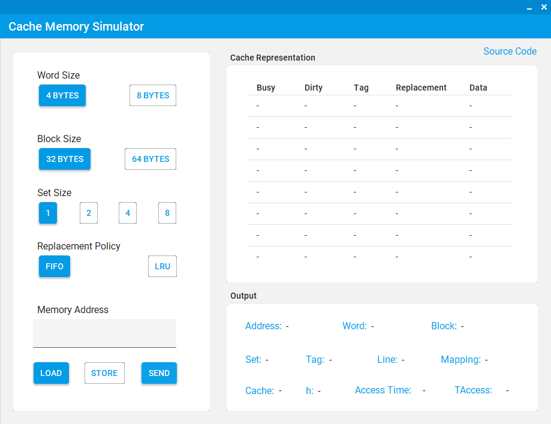

# CM-SimulatorGUI

Cache Memory Simulator

## Specs

- Words Size: 4/8 bytes

- Block Size: 32/64 bytes

- Set Size: 1/2/4/8 lines

- Replacement Policy: FIFO or LRU

---

## Material Skin

Using [MaterialSkin](https://github.com/leocb/MaterialSkin) by [Ignace Maes](https://github.com/IgnaceMaes) & [Leo Bottaro](https://github.com/leocb)
